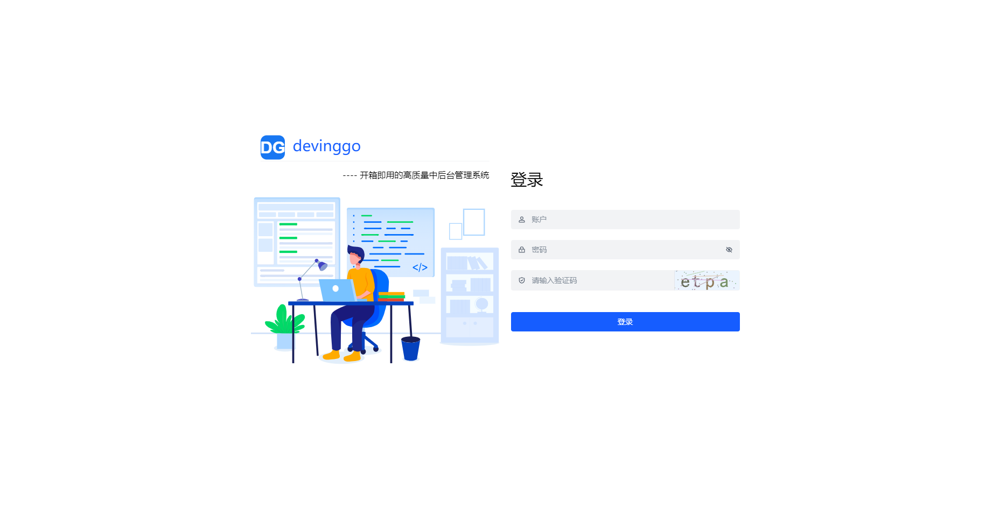
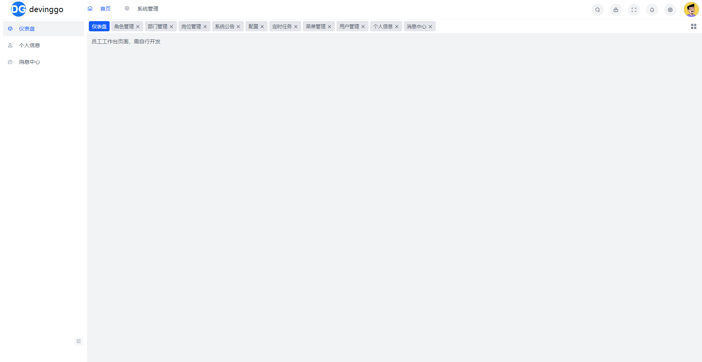
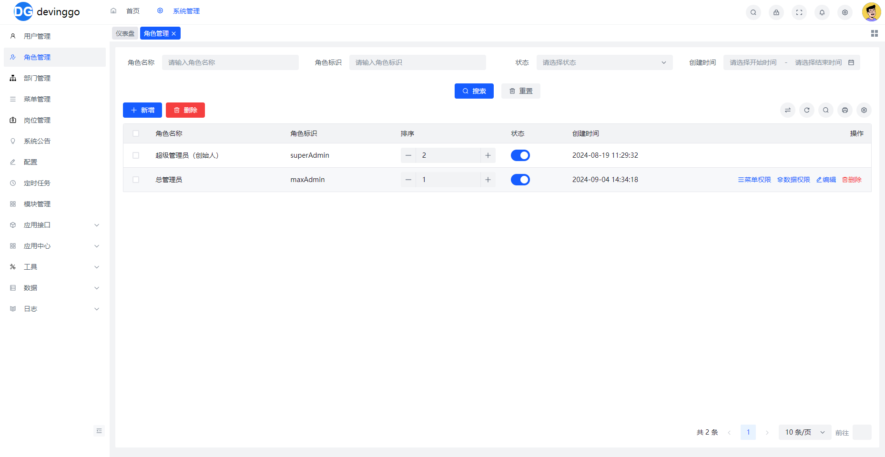
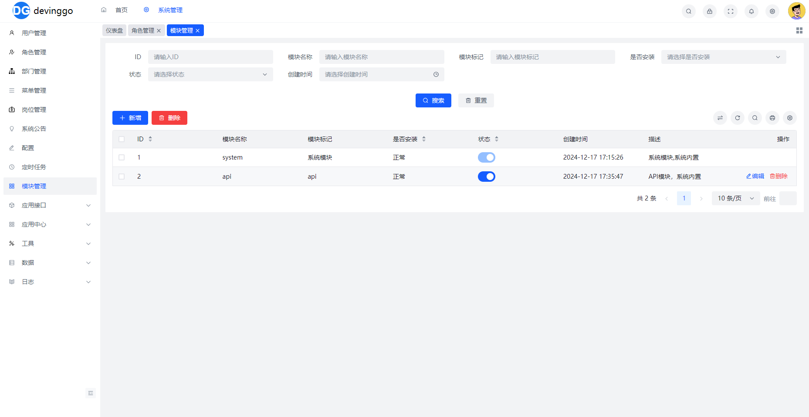

<p align="center">
  
</p>
<p align="center">
 
  
	
	
	
</p>

## 简介

`devinggo` 是一个基于 GoFrame v2 + Vue3 + Arco Design 开发的全栈前后端分离的后台管理系统。前端基于[MineAdmin-Vue V2](https://docv2.mineadmin.com/)技术栈，专注于提供一个简洁、高效、安全的开发框架。

## 演示地址
- 后台管理系统：https://devinggo-dev.devinghub.com/admin
- 账号密码：superAdmin/admin123
- 数据每小时重置一次

## 视频教程
- b站: https://space.bilibili.com/323699697

## 文档

- [文档](https://devinggo.devinghub.com/)

## 子模块地址

- [官网前端](https://github.com/huagelong/devingsite)
- [后台admin前端](https://github.com/huagelong/devingadmin)

## 截图






## 技术栈

- **后端**：GoFrame v2、MySQL or Postgresql、Redis
- **前端**：Vue3、Vite5、Arco Design、Pinia

## 功能特性
- [x] 支持mysql,postgresql
- [x] 支持多语言：支持多语言切换
- [x] 支持多主题：支持多主题切换
- [x] 支持队列：支持基于redis的队列
- [x] 支持websocket：支持websocket通信,websocket支持分布式服务器
- [x] 支持docker部署
- [x] 支持 migrate 数据库操作
- [x] 支持 module 模块管理
- [x] 支持 db 全局缓存
- [x] 接口文档：自动生成接口文档

## 核心功能

- [x] 用户管理：用户是系统操作者，该功能主要完成系统用户配置
- [x] 部门管理：配置系统组织机构（公司、部门），树结构展现支持数据权限
- [x] 岗位管理：配置系统用户所属担任职务
- [x] 菜单管理：配置系统菜单，操作权限，按钮权限标识等
- [x] 角色管理：角色菜单权限分配、设置角色按机构进行数据范围权限划分
- [x] 字典管理：对系统中经常使用的一些较为固定的数据进行维护
- [x] 参数管理：对系统动态配置常用参数
- [x] 通知公告：系统通知公告信息发布维护
- [x] 操作日志：系统正常操作日志记录和查询
- [x] 登录日志：系统登录日志记录和查询
- [x] 代码生成：前后端代码的生成；支持CRUD下载
- [x] 系统监控：Redis、在线用户监控
- [x] 模块管理：管理系统当前所有模块
- [x] 定时任务：在线（添加、修改、删除)任务调度包含执行结果日志
- [x] 附件管理：管理系统当前所有附件

## 环境要求

- Go >= 1.23.4
- Node >= 18
- MySQL >= 5.7 or PostgreSQL >= 13.0
- Redis >= 5.0

## 快速开始

> 以windows10以上系统为例

1. 安装make
```
#make 编译环境安装 ，打开cmd（管理员权限）执行
@powershell -NoProfile -ExecutionPolicy Bypass -Command "iex ((new-object net.webclient).DownloadString('https://chocolatey.org/install.ps1'))" && SET PATH=%PATH%;%ALLUSERSPROFILE%\chocolatey\bin
# or 打开powershell（管理员权限）执行
Set-ExecutionPolicy Bypass -Scope Process -Force; [System.Net.ServicePointManager]::SecurityProtocol = [System.Net.ServicePointManager]::SecurityProtocol -bor 3072; iex ((New-Object System.Net.WebClient).DownloadString('https://community.chocolatey.org/install.ps1'))

choco install make
choco install sed
```
2. 安装golang,node
```
choco install golang
choco install nodejs
```

3. 拉取子模块代码

```
git submodule update --init --recursive
git submodule foreach git pull origin master
```

4. 修改配置文件（mysql or postgresql,redis配置）
- `manifest/config/config.example.yaml` 复制为 `manifest/config/config.yaml`
- `manifest/config/config.yaml` # 修改redis,mysql配置
- `hack/config.example.yaml` 复制为 `hack/config.yaml` # 开发时使用
- `hack/config.yaml` # 开发时使用

5. 编译

```
make build
```
6. 导入数据库
```
go run main.go migrate:up
```
7. 启动
```
go run main.go
```
8. 访问
```
http://localhost:8070/admin
账号 superAdmin 密码 admin123
```

## 生成代码步骤

1. 新建sql
2. 填写hack/config.yaml和manifast/config/config.yaml里面的数据库信息，该步骤若在启动时已做了，就可以跳过
3. 新建模块，命令可以再go run main.go help查看
```
go run main.go module:create -name 模块名称
```
4. 登录后台，在工具，代码生成器里面填写相关信息
5. 生成代码，解压，把模块名字的文件夹复制到modules下，vue的文件下下面会有api和views两个文件夹，复制到web/admin/src下,然后执行sql文件夹里面以up.sql为结尾的sql脚本
6. 生成dao和service，在hack/hack.mk里面的service命令里面，新增如下语句
```
@gf gen service -s=modules/模块名称/logic -d=modules/模块名称/service
```
- 然后再终端执行
```shell
make dao
make service
```

7. 在modules下模块文件夹下，module.go文件里面，分组路由里面添加controller里面的控制器
8. 重启后端
## 交流社区

- QQ群：483122520

## 🎉 关注项目

- 如果项目对您有帮助，请点右上角 "Star" 收藏项目，您的支持是我创作的动力！

## 鸣谢

1. [GoFrame](https://github.com/gogf/gf)
2. [MineAdmin-Vue V2](https://docv2.mineadmin.com/)
3. [Arco Design](https://arco.design/)
4. [Pinia](https://pinia.vuejs.org/)
5. [Vue3](https://v3.cn.vuejs.org/)
6. [Vite5](https://cn.vitejs.dev/)
